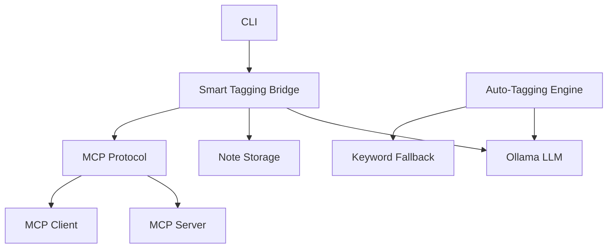

[](https://mseep.ai/app/spewp-mcp-smart-notes)

# mcp-smart-notes
Prototype Model Context Protocol (MCP) note-taking system with intelligent auto-tagging powered by local LLMs. Full MCP specification compliance, JSON-RPC 2.0 transport, and robust error handling with graceful fallbacks.
# MCP Smart Note-Taking System

[](https://www.python.org/downloads/)
[](https://modelcontextprotocol.io)
[](https://ollama.ai/)

A sophisticated **Model Context Protocol (MCP)** compliant note-taking system with **intelligent automatic tagging** capabilities powered by local Large Language Models via Ollama.

##  Features

- 🏷️ **Intelligent Auto-Tagging**: Uses LLM analysis to automatically categorize notes
- 📝 **Full MCP Compliance**: Implements complete MCP specification for seamless AI integration  
- 🔍 **Advanced Search**: Full-text search across titles, content, and tags
- 🗃️ **Robust Data Management**: JSON-based persistence with atomic operations
- 🛡️ **Error Resilience**: Multiple fallback mechanisms ensure reliability
- 🎯 **Tag Categories**: Predefined taxonomy: Greeting, Coding, Education, Finance
- 🤖 **Local AI**: Privacy-focused with local Ollama integration

## 🏗️ Architecture



## 🚀 Quick Start

### Prerequisites

- Python 3.8+
- [Ollama](https://ollama.ai/) installed and running
- Compatible LLM model (recommended: `qwen2.5:7b`)

### Installation

1. **Clone the repository**
   ```bash
   git clone https://github.com/yourusername/mcp-smart-notes.git
   cd mcp-smart-notes
   ```

2. **Install dependencies**
   ```bash
   pip install -r requirements.txt
   ```

3. **Start Ollama** (in another terminal)
   ```bash
   ollama serve
   ```

4. **Pull a compatible model**
   ```bash
   ollama pull qwen2.5:7b
   ```

### Usage

#### 🎯 Smart Auto-Tagging System (Recommended)
```bash
python smart_tagging_bridge.py
```
## 💡 Example Usage

```
You: Create a note about my Python web development project

🔧 Using tool: create_note
🏷️ Auto-assigned tags: ['Coding']
✅ Created note 'Python Web Development Project' with ID: 20250629_223459_661 with tags: ['Coding']
```

## 📁 Project Structure

```
MCP-Testing/
├── 📄 smart_tagging_bridge.py      # Main system with intelligent auto-tagging
├── 📄 note_server.py               # Full MCP server implementation
├── 📄 ollama_mcp_client.py         # MCP client for Ollama integration
├── 📄 simple_note_server.py        # Minimal MCP server for testing
├── 📄 simple_bridge.py             # Direct integration layer
├── 📄 test_auto_tagging.py         # Comprehensive test suite
├── 📄 requirements.txt             # Python dependencies
├── 📄 README.md                    # This file
├── 📄 .gitignore                   # Git ignore patterns
└── 📁 Documentation/     # MCP protocol documentation
```

## 🛠️ Available Tools

| Tool | Description | Usage |
|------|-------------|-------|
| `create_note` | Create notes with auto-tagging | Title, content, optional manual tags |
| `search_notes` | Full-text search | Query string matches title/content/tags |  
| `search_by_tag` | Tag-specific search | Find all notes with specific tag |
| `list_notes` | List all notes | Shows titles, IDs, and auto-tag indicators |
| `update_note` | Modify existing notes | Update title, content, or tags |
| `delete_note` | Remove notes | Permanent deletion by note ID |

## 🏷️ Auto-Tagging Categories

- **🤝 Greeting**: Welcomes, introductions, social interactions
- **💻 Coding**: Programming, development, technical content  
- **📚 Education**: Learning, courses, tutorials, studies
- **💰 Finance**: Budget, money, investments, financial planning

## 🔧 Technical Details

### MCP Protocol Compliance
- ✅ JSON-RPC 2.0 over stdio transport
- ✅ Tool registration with parameter schemas
- ✅ Resource discovery and URI handling
- ✅ Error handling and status codes
- ✅ Session management and lifecycle

### Error Handling
- **Ollama Offline**: Graceful degradation with helpful messages
- **LLM Failures**: Automatic keyword-based fallback tagging
- **File Corruption**: Silent skip of corrupted JSON files
- **Network Issues**: Retry mechanisms with exponential backoff

## 🤝 Contributing

1. Fork the repository
2. Create a feature branch (`git checkout -b feature/amazing-feature`)
3. Commit your changes (`git commit -m 'Add amazing feature'`)
4. Push to the branch (`git push origin feature/amazing-feature`)
5. Open a Pull Request

## 📚 Documentation

For detailed MCP protocol information, see:
- [Model Context Protocol Specification](https://modelcontextprotocol.io)
- [Documentation for Agent/](./Documentation%20for%20Agent/) - Complete MCP documentation

## 📝 License

This project is licensed under the MIT License - see the [LICENSE](LICENSE) file for details.

## 🙏 Acknowledgments

- [Model Context Protocol](https://modelcontextprotocol.io) team for the excellent specification
- [Ollama](https://ollama.ai/) for local LLM capabilities
- [Anthropic](https://anthropic.com) for Claude's assistance in development

## 🐛 Known Issues

- Large note collections may experience slower search performance
  
---

⭐ **Star this repository if you find it useful!** ⭐ 
